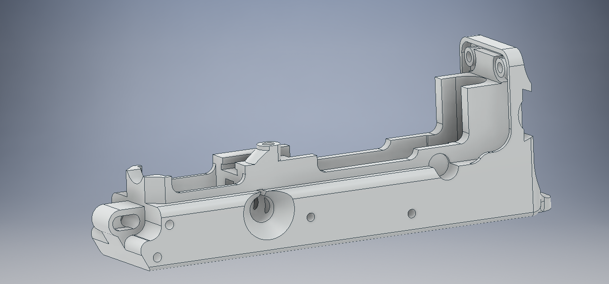

# vz61 reinforced semi auto receiver

Designed by **HulkHoganHH** (steamcommunity.com/id/HulkHoganHH, discord:HulkHoganHH#3508, thehulksterHH@gmail.com)

- An edit of an existing design to be 3d printer friendly
- Intermediate hand tool skills required
- Edited with Autodesk Inventor 2019

**I take no responsibility for any criminal activity committed with these files and will deny any involvement with any criminal parties. Be familiar with local laws before manufacturing. Any trouble you get into is your fault.**

This is a smaller print, the longest dimension is about 6.5 inches. An ar15 lower takes about 42 hours on my printer with 100% infill. This took about 12 hours.
PETG or other strong material recommended. I will test PLA soon.

## Why a vz61?
Parts kits are, as of August 2020, not scarce and can be obtained from anywhere around $290 to $375 depending on the seller and extras included. .32 auto (7.65 browning) is also a common round, despite its lower demand. Current events at the time of writing have affected almost all gun prices and sales except for .32 auto. If you are very lucky, you can find a .22lr upper conversion kit.

When buying a kit, be sure that you are buying a kit with a barrel and sights already installed as these are not easy to install without proper tools. 

## Materials
- 4mm OD steel pins
- 1/8" OD steel pins
- A vz61 parts kit

## Tools needed
- m15x1-h2 metric tap
- flat file 
- triangular (equilateral) file if you decide to add the stock
- metric drill set
- 1/8" OD drill
- dremel
- drill press with vise recommended for handle threading

## Where to drill? (recommended depending on printer)
- The two 4mm holes for the hammer and trigger
- the 5mm takedown hole in the front
- the 9mm hole for the magazine catch/button (clean this hole well to prevent sticking)
- the 3mm hole in the middle section of the receiver (be very careful to not drill all the way through, however if you do you can tap and plug the hole with a short screw)
- the 4mm hole for the bolt hold open (clean well to prevent sticking)
- the two 1/8" holes next to the takedown hole in the front of the receiver (if reinforcing with steel pins)
